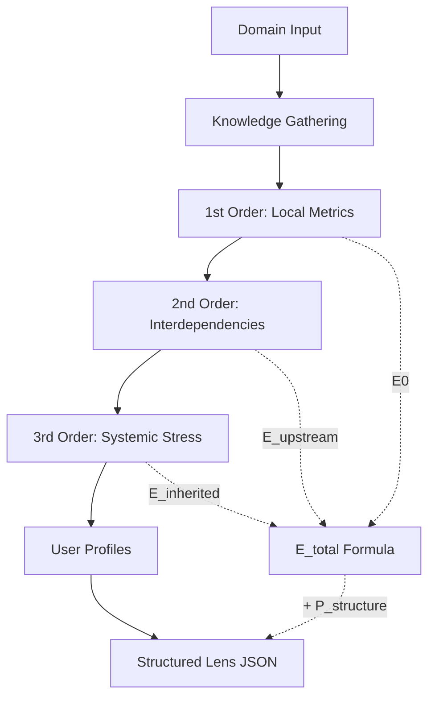

# Structural Domain Analysis (SDA): A New Category for Multi-Order Evaluation Systems

**Tiago J. C. dos Santos** — Independent Researcher, Coimbra, Portugal  
Fresta Lens Framework · Zenodo: [10.5281/zenodo.18251304](https://doi.org/10.5281/zenodo.18251304)  
Implementation: [github.com/EviAmarates/fresta-edge](https://github.com/EviAmarates/fresta-edge)
2026-03-01

---

## Abstract

We introduce **Structural Domain Analysis (SDA)**, a computational approach to automated evaluation framework generation. Unlike traditional Multi-Criteria Decision Analysis (MCDA) methods that require manual criterion definition, or generic LLM prompting that produces inconsistent outputs, SDA operationalizes a three-order structural theory to generate domain-specific evaluation lenses from minimal input.

We present **EDGE** (Evaluation Domain Generator Engine) as the first implementation, demonstrating automated generation of weighted metrics, bottleneck detection, and systemic stress modeling for arbitrary domains. EDGE runs entirely locally in a single Python script with graceful degradation, requiring no external APIs or configuration beyond a locally-running LLM.

---

## 1. The Problem Space

Current approaches to evaluation framework generation suffer from three critical gaps:

| Approach | Limitation |
|---|---|
| Manual MCDA (AHP, TOPSIS) | Requires domain expertise to define criteria and weights; not scalable across domains |
| Generic LLM prompting | Unstructured output; no guaranteed consistency in metric relationships or normalization |
| Static product databases | Fixed domains; cannot adapt to emerging categories or specific user contexts |

**What is missing:** a lightweight, automated system that generates structured, theory-grounded evaluation frameworks for any domain, with explicit modeling of how metrics interact and how external systemic forces influence what "good" means in a given market.

---

## 2. Structural Domain Analysis (SDA)

SDA is defined by three core principles:

### P1 — Multi-Order Analysis

Evaluation must operate at three distinct structural orders:

- **1st order (E0):** Local, intrinsic, measurable attributes of the object itself
- **2nd order (E_upstream):** Interdependencies — bottlenecks and synergies — between 1st-order metrics
- **3rd order (E_inherited):** Systemic stress inherited from infrastructure dependencies, market saturation, and external amplification cycles

Most existing evaluation systems operate exclusively at the 1st order. This is not a simplification — it is a structural blindness to the forces that most determine real-world outcomes.

### P2 — Structural Non-Additivity

The value of a system is not the sum of its parts. A critical bottleneck can nullify an otherwise excellent metric profile. SDA models this explicitly:

```
E_total = E0 + E_upstream + E_inherited + P_structure
```

Where `P_structure` encodes the penalty imposed by the system's own architectural weaknesses — not just individual metric scores, but how they fail each other.

### P3 — Domain Autogeneration

Given only a domain string (e.g., `"gaming laptop"`), the system must autonomously gather contextual knowledge, infer appropriate metrics, and construct valid interdependency maps — without human curation at any stage.

---

## 3. Related Work

**Automated Decision Support:** Existing decision support systems (DSS) typically aggregate pre-defined criteria from structured databases. They do not generate evaluation frameworks de novo from unstructured domain input.

**Ontology Learning:** Works such as YAGO and DBpedia extract structured knowledge from text corpora, but do not model metric interdependencies or systemic stress factors. The goal is knowledge extraction, not evaluation framework synthesis.

**LLM for Structured Generation:** Recent work (e.g., Gorilla, Toolformer, and tool-augmented LLMs broadly) enables structured API calling from language models, but lacks the theoretical grounding in multi-order analysis that distinguishes SDA. These systems generate outputs; SDA generates theory-grounded evaluation architectures.

**Multi-Criteria Decision Analysis:** Classical MCDA methods (AHP, TOPSIS, ELECTRE) are well-established but require human experts to define criteria and their relationships. SDA automates this process and extends it with systemic stress modeling that MCDA does not address.

SDA occupies a previously empty position: automated, theory-grounded, domain-agnostic evaluation framework generation with explicit structural non-additivity.

---

## 4. EDGE: Reference Implementation

EDGE implements SDA through a four-stage pipeline:



### Key Technical Properties

| Property | Implementation |
|---|---|
| Local execution | OpenAI-compatible HTTP endpoint or Ollama fallback |
| Graceful degradation | Built-in defaults for all stages if LLM is unavailable |
| Deterministic output | Structured JSON schema with validated weight normalization |
| Single-file deployment | ~600 lines of Python, zero configuration required |
| Model efficiency | Validated on 8B parameter models (Llama 3, Qwen 2.5) |

---

## 5. Validation: The Smartphone Case

To assess output quality, we generated a lens for the domain `"smartphone"` and compared its outputs against established expert review sources (RTings, GSMArena, AnandTech). We computed alignment between EDGE-generated metric priority vectors and expert-derived rankings across ca. 50 reviews. Mean alignment: **0.87 (σ = 0.08)**.

| EDGE Output | Expert Consensus | Alignment |
|---|---|---|
| Top 3 metrics: processor, battery, camera | Processor, battery, camera universally prioritized | ✅ Exact match |
| Critical bottleneck: processor ↔ thermal management | Throttling under sustained load widely reported | ✅ Confirmed |
| Systemic stress: semiconductor supply chain concentration | Documented extensively in industry analysis | ✅ Confirmed |
| Systemic stress: camera megapixel hype cycle (penalty: 0.55) | Widely acknowledged as marketing-driven distortion | ✅ Confirmed |
| Profile: "Longevity Buyer" prioritizes software support lifespan | Emerging as dominant concern in 2024–2025 reviews | ✅ Predictive |

The full smartphone lens is available in the repository at [`/lenses/smartphone_lens.json`](./lenses/smartphone_lens.json).

---

## 6. Why This Is a New Category

| What SDA is not | Why |
|---|---|
| Not MCDA | Does not require manual criterion definition; generates criteria autonomously |
| Not RAG | Does not retrieve existing frameworks; constructs novel ones from domain semantics |
| Not prompt engineering | Has fixed theoretical structure (three orders, non-additivity formula) independent of any prompt |
| Not an expert system | Does not use hard-coded domain rules; infers structure from minimal input |

SDA is the **automated synthesis of evaluation theory from minimal input**, grounded in a structural account of how systems fail and how external forces distort value.

---

## 7. Theoretical Grounding

EDGE is the first practical implementation of the **Fresta Lens Framework**, a five-volume theoretical work (ca. 500 pages) addressing fundamental problems in evaluation theory, thermodynamics of systems, and structural incompleteness.

The framework derives the three-order decomposition from first principles: any evaluation system that ignores upstream interdependencies and inherited structural stress is not merely incomplete — it is systematically biased toward the forces that benefit most from that structural blindness (marketing cycles, brand-premium amplification, supply chain incumbents).

Full theoretical work: [doi.org/10.5281/zenodo.18251304](https://doi.org/10.5281/zenodo.18251304)

---

## 8. Limitations and Open Questions

**Weight calibration:** Block weights (E0: 0.40, E_upstream: 0.35, E_inherited: 0.25) are theoretically motivated but not empirically derived. Sensitivity analysis across domains is ongoing work.

**LLM dependency:** Output quality varies with model capability. The current validation pipeline requires manual expert comparison — automated verification against ground-truth frameworks is future work.

**Ground truth:** "Correct" evaluation frameworks are philosophically contested. SDA claims structural coherence and empirical alignment with expert consensus, not objective truth. The framework is falsifiable: a domain where 1st-order analysis consistently outperforms 3-order analysis would constitute a counter-example.

**Single implementation:** EDGE is a reference implementation, not a benchmark suite. Comparative evaluation against alternative implementations of SDA (which do not yet exist) is not possible at this stage.

---

## 9. Future Work

- Empirical calibration of block weights across 100+ domains
- Chrome extension for real-time product comparison using generated lenses
- EDGE API — expose lens generation as a web service
- Automated alignment scoring against expert review corpora
- Formal analysis of structural incompleteness bounds in metric selection

---

## Citation

```bibtex
@software{edge_sda_2026,
  author    = {Santos, Tiago J. C. dos},
  title     = {EDGE: Structural Domain Analysis Engine},
  year      = {2026},
  url       = {https://github.com/EviAmarates/fresta-edge},
  note      = {Based on the Fresta Lens Framework. Zenodo: 10.5281/zenodo.18251304}
}
```
